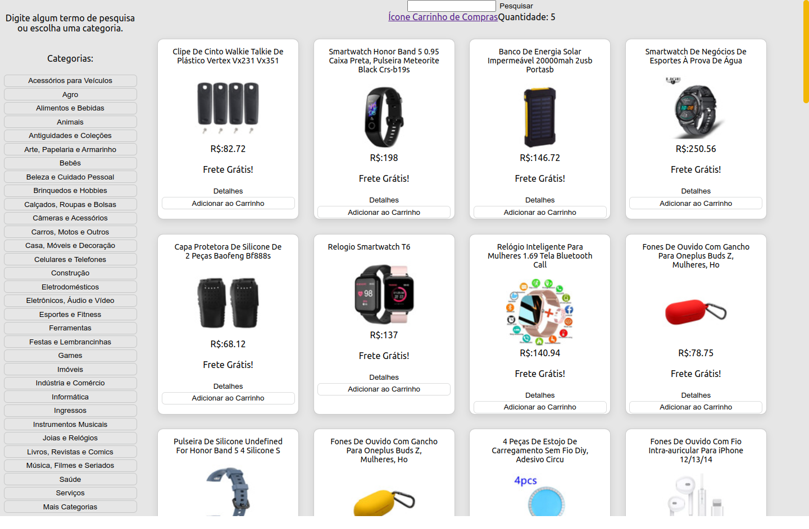
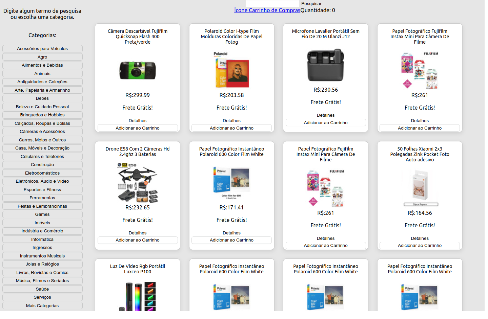

# Online Store

## Contexto

Este projeto trata-se de uma loja online sem persistência no banco de dados. Consome a API do mercado livre para buscar os produtos por catigorias e termos

Colegas que contribuiram com o projeto:

- [@andregraczyk](https://github.com/andregraczyk "github")
- [@matheus-a-f](https://github.com/matheus-a-f "github")
- [@eliaspaiva](https://github.com/eliaspaiva "github")
  
## Técnologias usadas

Front-end:
> Desenvolvido usando: React, React Router, CSS3, ES6

## Preview da Aplicação

|  |  |
| ----------- | ----------- |

## Instalando Dependências

- Clone o projeto:

  ```bash
  git clone git@github.com:Andreyrvs/15-Frontend-Online-Store.git
  ```

  > Front-end

  ```bash
  cd 15-Frontend-Online-Store
  npm install
  ```

## Executando aplicação

- Para rodar o Front-end:

  ```bash
  cd src/ && npm start
  ```
